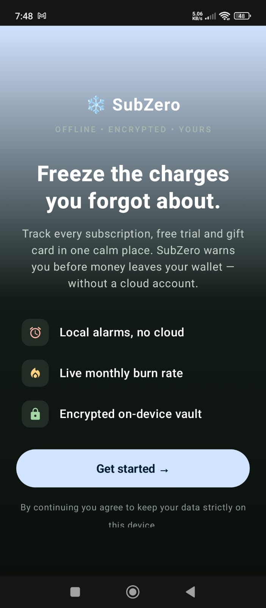

# SubZero ❄️
### *The Ultimate Privacy-First Subscription Management Vault*

<p align="center">
  
  
  
  
  
</p>

---

## Table of Contents

- [App Preview](#app-preview)
- [Why This App Stands Out](#why-this-app-stands-out)
- [Tech Stack](#tech-stack)
- [Project Structure](#project-structure)
- [Getting Started](#getting-started)
- [Privacy & Security](#privacy--security)
- [License](#license)
- [Contact](#contact)

---

## App Preview

SubZero is a high-performance, offline-first subscription tracking engine built with **Modern Android Development (MAD)** standards. It is designed for users who demand absolute privacy and financial clarity, featuring hardware-backed security and an integrated AI Financial Advisor.

| Onboarding | Dashboard | AI Advisor |
| :---: | :---: | :---: |
|  |  |  |

| Alerts & Nudges | Vault Management |
| :---: | :---: |
|  |  |

---

## Why This App Stands Out

### 🛡️ Ironclad Security & Privacy
- **Biometric Vault:** Access is secured via the Android Biometric API (Fingerprint/Face Unlock).
- **Auto-Lock Engine:** The application automatically locks when moved to the background or during device inactivity (`ON_STOP` lifecycle management).
- **Zero-Cloud Architecture:** Your sensitive data never leaves your device. No analytics, no tracking, and no external storage.
- **Encrypted Backups:** Export your vault data to JSON or CSV using **AES-256 encryption** with a user-defined master password.

### 🤖 SubZero AI Advisor (Gemini Integration)
- **Financial Intelligence:** Utilizes **Google Gemini 1.5 Flash** (via Vertex AI) to analyze spending patterns.
- **Punchy Optimization Tips:** Provides actionable advice to reduce subscription fatigue and monthly "drain."
- **Overlap Analysis:** Detects redundant services (e.g., identifying standalone streaming subs that are already included in an ecosystem bundle like Apple One or Amazon Prime).

### 📊 Advanced Analytics & Insights
- **Burn Rate Tracking:** Real-time calculation of **Monthly and Annual Drain**.
- **Category Breakdown:** Visualize spending across SaaS, Streaming, Gaming, Gyms, Curated Boxes, and more.
- **Trial Management:** Dedicated tracking for "Free Trials" with automatic countdowns and "cancel before" reminders.

---

## Tech Stack

- **UI:** 100% **Jetpack Compose** with Material 3.
- **Language:** Kotlin with Coroutines & Flow for reactive data streams.
- **Database:** **Room Persistence Library** for high-performance offline storage.
- **AI Engine:** **Firebase Vertex AI SDK** for secure communication with Gemini.
- **Architecture:** **MVVM** (Model-View-ViewModel) + Repository Pattern.
- **Security:** Android Biometric API & AES Encryption helpers.
- **Serialization:** **Moshi** for robust JSON processing.
- **Scheduling:** `AlarmManager` for precise, battery-efficient local reminders.

---

## Project Structure

```text
app/src/main/java/com/example/subzero/
├── alarm/          # AlarmManager, Notification logic, and BroadcastReceivers
├── data/           # Room Database, DAOs, and the core 'Asset' Entity model
├── ui/
│   ├── screens/    # Composable screens: Dashboard, Vault, Insights, Alerts, Add/Edit
│   └── theme/      # Material 3 Color Schemes, Typography, and Shapes
├── utils/          # Encryption utilities, Date formatters, and Helpers
└── viewmodel/      # Core business logic, Financial calculations, and AI integration
```

---

## Getting Started

### Prerequisites
- Android Studio **Ladybug (2024.2.1)** or newer.
- Android SDK **Level 35** (Compile SDK).
- A physical device or emulator with **Biometric** support enabled.

### Setup Steps
1. **Clone the repository:**
   ```bash
   git clone https://github.com/VINIT0207/SubZero.git
   ```
2. **Environment Variables:**
   The AI Advisor requires a Gemini API Key. Create a `.env` file in the root directory:
   ```env
   GOOGLE_AI_API_KEY=your_gemini_api_key_here
   ```
3. **Build & Run:**
   Sync Gradle and deploy the `:app` module to your device.

---

## Privacy & Security

SubZero is built on the principle of **Data Sovereignty**.
- **No data collection:** All information remains in a local, encrypted SQLite database.
- **No cloud sync:** We do not provide a cloud backup service to ensure your data is never outside your control.
- **On-demand AI:** Subscription data is sent to Vertex AI only when you request advice, and it is not stored permanently.

---

## License

*This project is provided without a license. All rights reserved by the original author.*

---

## Contact

For any inquiries or feedback, please reach out via:
- **Email:** [vinit.sharma.0207@gmail.com](mailto:vinit.sharma.0207@gmail.com)
- **GitHub:** [VINIT0207](https://github.com/VINIT0207)
